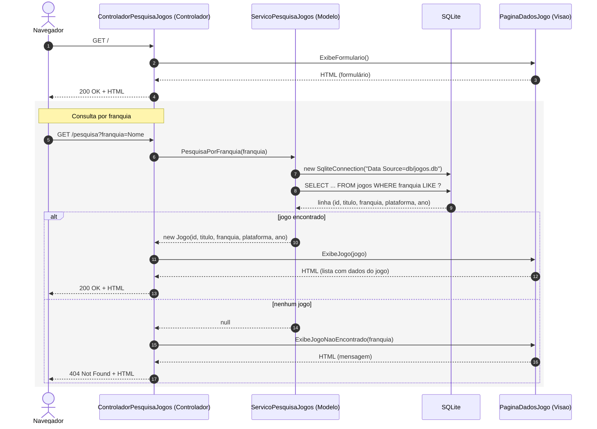

# Exemplo de MVC: RetroGames

Exemplo mínimo de uma aplicação C#/.NET que segue uma Arquitetura MVC, com motivação didática apenas.

- **Modelo:** pasta `Modelo` (`Jogo` e `ServicoPesquisaJogos`, que consulta o banco SQLite)
- **Visão:** pasta `Visao` (`PaginaDadosJogo`, que gera o formulário e o HTML da resposta)
- **Controlador:** pasta `Controladores` (`ControladorPesquisaJogos`, que recebe as requisições `/` e `/pesquisa`, chama o Modelo na pesquisa e escolhe a Visão)
- `Program.cs` só monta as peças e liga o servidor web.

## Como Executar?

Requisito: [.NET SDK 8](https://dotnet.microsoft.com/download) (no Ubuntu: `sudo apt install dotnet-sdk-8.0`).

Digite no diretório do projeto:

```dotnet run```

E depois entre em um browser e digite: `http://localhost:5000`

Franquias disponíveis: **Mario**, **The Legend of Zelda** e **Metroid**
(pode digitar só parte do nome, como `zelda`).

## Diagrama de Sequência



## Para ir além

O ASP.NET Core tem um framework MVC completo (classes `Controller` e páginas
Razor `.cshtml`), que segue a "vertente Web" de MVC discutida na seção 7.3 do
livro. Este exemplo monta as três partes à mão, de propósito, para que o papel
de cada uma fique visível.
